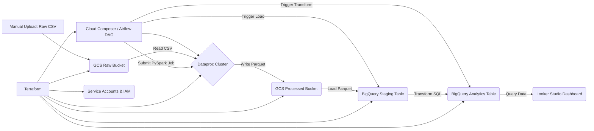

# GCP End-to-End Open Payments Data Pipeline & Dashboard

## Objective
This project implements an end-to-end data pipeline on Google Cloud Platform (GCP) to process the CMS Open Payments dataset and visualize key insights on a dashboard. It demonstrates proficiency in various data engineering tools and concepts learned during the Data Engineering Zoomcamp.

## Problem Statement
The goal is to create a data pipeline that ingests, processes, and warehouses the CMS Open Payments data for Program Year 2023. Subsequently, a dashboard with at least two visualizations should be developed:
1.  A graph showing the distribution of a categorical variable (e.g., payments by nature or state).
2.  A graph showing the distribution of data over time (e.g., total payment amount per month).

### Dataset
The dataset used is the **CMS Open Payments General Payments Data for Program Year 2023**. This dataset contains detailed information about payments made by applicable manufacturers and group purchasing organizations (GPOs) to physicians and teaching hospitals.
*   **Source:** Centers for Medicare & Medicaid Services (CMS) Open Payments Data
*   **Specific File Used:** `OP_DTL_GNRL_PGYR2023_P01302025.csv` (extracted from the official zip file)
*   **Download Link (Zip):** [https://download.cms.gov/openpayments/PGYR2023_P01302025_01212025.zip](https://download.cms.gov/openpayments/PGYR2023_P01302025_01212025.zip)

## Architecture

This project implements a **batch processing** pipeline. This approach was chosen because the source dataset (Open Payments data) is published periodically (annually) and does not require real-time streaming.

The pipeline follows these steps:

1.  **Infrastructure Provisioning:** Terraform is used to define and create the necessary GCP resources (GCS buckets, BigQuery datasets, Dataproc cluster, Service Accounts, IAM permissions).
2.  **Data Ingestion (Manual Upload):** The raw CSV data (unzipped) is manually uploaded to a designated GCS "raw" bucket (Data Lake - Bronze Layer).
3.  **Orchestration (Airflow):** A Cloud Composer (managed Airflow) environment orchestrates the pipeline defined in a DAG.
4.  **Data Processing (Spark):** The Airflow DAG triggers a PySpark job on a Dataproc cluster. This job reads the raw CSV from GCS, performs basic cleaning (schema enforcement, column selection), and writes the processed data in Parquet format to a "processed" GCS bucket (Data Lake - Silver Layer).
5.  **Data Loading (GCS to BQ):** The DAG uses a `GCSToBigQueryOperator` to load the processed Parquet data from GCS into a BigQuery staging table.
6.  **Data Transformation (BigQuery SQL):** The DAG executes a SQL query within BigQuery to transform the staging data (casting types, handling nulls, selecting final columns) and loads it into a final analytics table, partitioned and clustered for performance. (Data Warehouse - Gold Layer).
7.  **Visualization (Looker Studio):** A Looker Studio dashboard connects to the final BigQuery analytics table to visualize the required insights.

### Architecture Diagram

## Technologies Used
* **Cloud Provider:** Google Cloud Platform (GCP)

* **Infrastructure as Code (IaC):** Terraform

* **Workflow Orchestration:** Apache Airflow (via Cloud Composer 2)

* **Data Lake:** Google Cloud Storage (GCS)

* **Batch Processing:** Apache Spark (via Dataproc)

* **Data Warehouse:** Google BigQuery

* **Business Intelligence / Visualization:** Looker Studio (formerly Google Data Studio)

* **Language:** Python (for PySpark and Airflow DAG)

* **Data Format:** CSV (raw), Parquet (processed)

## Pipeline Details & Code
### 1. Infrastructure (Terraform)
The infrastructure is defined in [`./terraform/main.tf`](./terraform/main.tf). It provisions the following GCP resources:

*   **GCS Buckets:**
    *   `<project-id>-datalake-raw`: Stores the initial raw CSV data uploads (Bronze Layer). Lifecycle rule configured to delete objects older than 30 days (configurable).
    *   `<project-id>-datalake-processed`: Stores the processed data in Parquet format generated by Spark (Silver Layer).
    *   `<project-id>-spark-scripts`: Used to store the PySpark processing script (`process_payments.py`) for Dataproc access.
    *   `<project-id>-airflow-dags`: Intended for Airflow DAGs. *Note: Cloud Composer typically creates and uses its own dedicated bucket for DAGs, which should be used in practice.*

*   **BigQuery Datasets:**
    *   `open_payments_staging`: Dataset for the staging table (`raw_payments`) loaded directly from the processed GCS Parquet files. Configured with `delete_contents_on_destroy = true` for development ease.
    *   `open_payments_analytics`: Dataset for the final analytics table (`payments_reporting`) used by Looker Studio (Gold Layer). Also configured with `delete_contents_on_destroy = true`.

*   **Dataproc Cluster:**
    *   A cluster named `etl-cluster-<region>` (e.g., `etl-cluster-us-central1`) is created for running the PySpark job.
    *   Uses standard machine types (configurable in `main.tf`).
    *   Configured to run using the `dataproc-sa@...` service account.

*   **IAM Permissions:**
    *   **`dataproc-sa@...` Service Account:** Granted necessary roles (`roles/storage.objectViewer` on raw bucket, `roles/storage.objectCreator` on processed bucket, `roles/bigquery.dataEditor` on staging dataset, `roles/dataproc.worker`) to allow cluster nodes to read from GCS, write to GCS, write to the BigQuery staging table, and operate as Dataproc workers.
    *   **`de-project-service-account@...` Service Account:** This account is used by Cloud Composer/Airflow. It's granted roles (`roles/storage.objectAdmin` on the DAGs bucket (or the Composer bucket), `roles/storage.objectViewer` on the Spark scripts bucket, `roles/dataproc.editor` to submit jobs, `roles/bigquery.dataEditor` on staging and analytics datasets, `roles/bigquery.jobUser` to run BQ jobs, and the essential `roles/composer.worker` for Composer operations) allowing it to manage DAGs, read scripts, submit Dataproc jobs, load data into BigQuery, run transformation queries, and interact with the Composer environment.

*(Link to main Terraform code: [`./terraform/main.tf`](./terraform/main.tf))*
*(See the file for detailed resource configurations and variable definitions)*

### 2. Data Processing (Spark)

The PySpark script [`./spark/process_payments.py`](./spark/process_payments.py) handles the initial Extract, Transform, Load (ETL) phase from the raw data lake layer to the processed layer:

*   **Schema Definition:** A `StructType` schema is explicitly defined based on the known columns of the `OP_DTL_GNRL_PGYR2023_P01302025.csv` file. This ensures data types are correctly inferred (especially for amounts and potentially problematic fields) and improves the performance and reliability of reading the large CSV file compared to `inferSchema=true`.
*   **Reading Data:** The script reads the specific CSV file from the `gs://<project-id>-datalake-raw/open_payments/unzipped/` path using `spark.read.csv()`, applying the defined schema and options like `header=True`, `multiLine=True`, and `escape='"'` to handle potential complexities in the data.
*   **Transformation:**
    *   **Column Selection:** Only columns deemed necessary for the final analytics table and potential future use are selected using `.select()`.
    *   **Renaming:** Key columns are renamed using `.alias()` for better readability and consistency (e.g., `Total_Amount_of_Payment_USDollars` becomes `payment_amount_usd`, `Covered_Recipient_Specialty_1` becomes `physician_specialty`).
    *   **Basic Filtering:** A simple filter (`.filter(F.col("Record_ID").isNotNull())`) is applied to remove any potential records lacking a primary identifier.
*   **Writing Data:** The processed DataFrame is written to the processed GCS bucket (`gs://<project-id>-datalake-processed/open_payments_parquet/`) in **Parquet** format.
    *   **Format Choice:** Parquet is chosen for its efficient columnar storage, compression capabilities, and excellent integration with downstream tools like BigQuery and Spark.
    *   **Write Mode:** `mode="overwrite"` is used to ensure that each run of the pipeline replaces the previous processed data, suitable for a batch workflow processing a full dataset snapshot.

*(Link to PySpark code: [`./spark/process_payments.py`](./spark/process_payments.py))*

---

### 3. Orchestration (Airflow)

The entire pipeline workflow is orchestrated using Apache Airflow, managed via **Google Cloud Composer 2**. The Directed Acyclic Graph (DAG) definition is located in [`./airflow/dags/open_payments_dag.py`](./airflow/dags/open_payments_dag.py).

*   **DAG Schedule:** Configured to run daily (`schedule_interval='@daily'`) but primarily triggered manually for this project. `catchup=False` prevents backfilling for past missed schedules.
*   **Operators Used:**
    1.  `DataprocSubmitPySparkJobOperator` (`submit_spark_processing_job` task): Submits the `process_payments.py` script to the provisioned Dataproc cluster, passing the GCS input and output paths as arguments.
    2.  `GCSToBigQueryOperator` (`load_processed_parquet_to_bq_staging` task): Loads the Parquet files generated by the Spark job (using wildcard `*.parquet`) from the processed GCS bucket into the BigQuery staging table (`open_payments_staging.raw_payments`). It uses `autodetect=True` for schema detection from Parquet and `write_disposition='WRITE_TRUNCATE'` to replace the table content on each run.
    3.  `BigQueryExecuteQueryOperator` (`transform_in_bq` task): Executes the final SQL transformation query directly within BigQuery to populate the analytics table (`open_payments_analytics.payments_reporting`) from the staging table. The SQL query is embedded within the DAG file for simplicity in this project.
*   **Task Dependencies:** The tasks are linked sequentially: `submit_spark_processing_job` >> `load_processed_parquet_to_bq_staging` >> `transform_in_bq`.
*   **Configuration:** Variables at the top of the DAG file define GCP project ID, region, bucket names, BigQuery dataset/table names, and Dataproc cluster name, ensuring consistency with the Terraform setup.

*(Link to Airflow DAG code: [`./airflow/dags/open_payments_dag.py`](./airflow/dags/open_payments_dag.py))*

---

### 4. Data Warehousing & Transformation (BigQuery)

Google BigQuery serves as the data warehouse for this project.

*   **Staging Layer:**
    *   Dataset: `open_payments_staging`
    *   Table: `raw_payments`
    *   Purpose: Holds the intermediate data loaded directly from the processed Parquet files in GCS. This table structure mirrors the Parquet schema. It is overwritten on each pipeline run.

*   **Analytics Layer (Gold Layer):**
    *   Dataset: `open_payments_analytics`
    *   Table: `payments_reporting`
    *   Purpose: This is the final, cleaned, and optimized table designed for consumption by the BI tool (Looker Studio).
    *   **Transformation Logic (SQL):** The `BigQueryExecuteQueryOperator` runs a `CREATE OR REPLACE TABLE ... AS SELECT ...` statement. Key transformations include:
        *   Selecting specific columns required for the dashboard (`Record_ID`, `recipient_npi`, `recipient_first_name`, `recipient_last_name`, `recipient_city`, `recipient_state`, `physician_specialty`, `payer_name`, `payment_form`, `payment_nature`, `program_year`, `payment_date_str`, `payment_amount_usd`).
        *   **Data Type Conversion & Cleaning:** Using `SAFE.PARSE_DATE('%m/%d/%Y', payment_date_str)` to convert the payment date string into a proper `DATE` type, safely handling potential parsing errors (returning NULL instead of failing). Using `SAFE_CAST(payment_amount_usd AS NUMERIC)` to convert the payment amount into a `NUMERIC` type, also handling errors safely.
        *   **Filtering:** The `WHERE` clause (`SAFE.PARSE_DATE(...) IS NOT NULL AND SAFE_CAST(...) IS NOT NULL`) ensures that only records with valid, parseable dates and amounts are included in the final analytics table, improving data quality for visualization.
    *   **Table Optimization:**
        *   **Partitioning:** The table is partitioned by the `payment_date` column (`PARTITION BY payment_date`). Since dashboards often allow filtering by date ranges (e.g., last month, specific quarter, year), partitioning ensures that BigQuery only scans the necessary partitions (days, in this case) relevant to the query's date filter, significantly reducing query cost and improving performance.
        *   **Clustering:** The table is clustered by `recipient_state` and `payment_nature` (`CLUSTER BY recipient_state, payment_nature`). These columns are used as dimensions in the dashboard's categorical visualizations. Clustering physically co-locates data rows with the same state or payment nature within each partition, which speeds up queries that filter or aggregate on these columns (e.g., `WHERE recipient_state = 'CA'` or `GROUP BY payment_nature`).

*(Link to Transformation SQL (embedded in DAG): [`./airflow/dags/open_payments_dag.py`](./airflow/dags/open_payments_dag.py) - see `TRANSFORM_SQL` variable)*
*(Or if externalized: [`./sql/transform_payments.sql`](./sql/transform_payments.sql))*

---

### 5. Dashboard

A dashboard was created using **Looker Studio** to visualize the insights from the processed data.

*   **Data Source:** The dashboard connects directly to the final analytics table: `original-glider-455309-s7.open_payments_analytics.payments_reporting` in BigQuery.
*   **Visualizations:**
    1.  **Categorical Distribution:** A bar chart titled "Payment Count by Nature" displays the number of payment records (`Record Count`) grouped by the `payment_nature` dimension.
    2.  **Temporal Distribution:** A time-series chart titled "Total Payment Amount Over Time" displays the sum of `payment_amount_usd` aggregated by month, using `payment_date` as the time dimension.
*   **Interactivity:** A **Date Range Control** filter is included and recommended to be set to **Jan 1, 2023 - Dec 31, 2023** to view the data relevant to Program Year 2023, taking advantage of the table partitioning.
*   **Note:** The dashboard only reflects data for **Program Year 2023**.

**Dashboard Screenshot:**
 *(Ensure `images/dashboard.png` exists)*

**(Optional: Provide Link to Dashboard)**
[Link to Looker Studio Dashboard](YOUR_DASHBOARD_LINK_HERE - *mention if login is required*)

