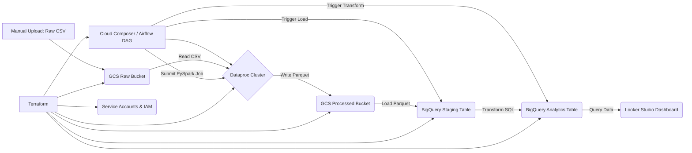
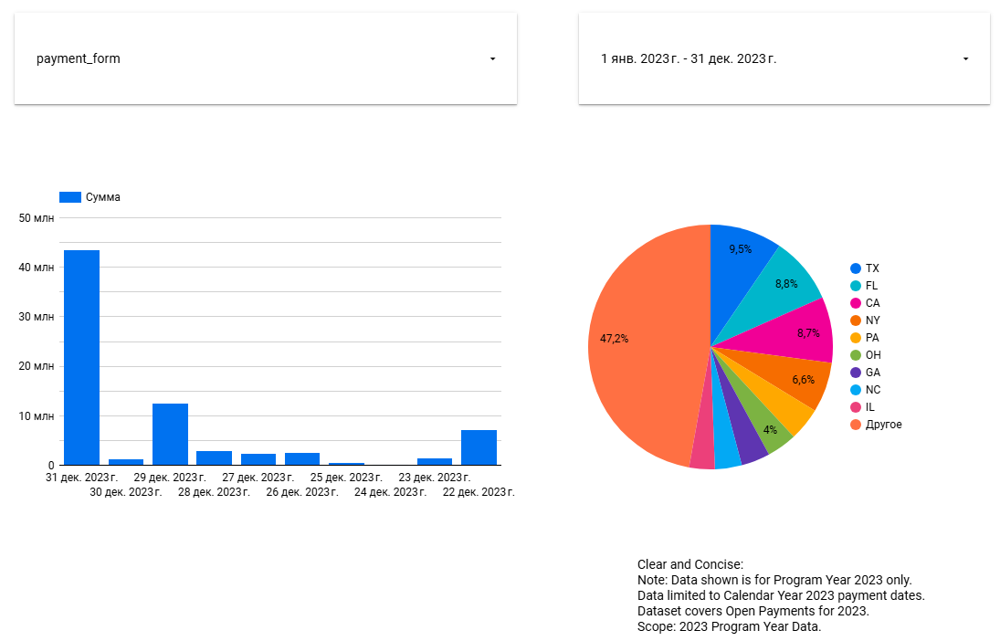

# GCP End-to-End Open Payments Data Pipeline & Dashboard

## Objective
This project implements an end-to-end data pipeline on Google Cloud Platform (GCP) to process the CMS Open Payments dataset and visualize key insights on a dashboard. It demonstrates proficiency in various data engineering tools and concepts learned during the Data Engineering Zoomcamp.

## Problem Statement
The goal is to create a data pipeline that ingests, processes, and warehouses the CMS Open Payments data for Program Year 2023. Subsequently, a dashboard with at least two visualizations should be developed:
1.  A graph showing the distribution of a categorical variable (e.g., payments by nature or state).
2.  A graph showing the distribution of data over time (e.g., total payment amount per month).

### Dataset
The dataset used is the **CMS Open Payments General Payments Data for Program Year 2023**. This dataset contains detailed information about payments made by applicable manufacturers and group purchasing organizations (GPOs) to physicians and teaching hospitals.
*   **Source:** Centers for Medicare & Medicaid Services (CMS) Open Payments Data
*   **Specific File Used:** `OP_DTL_GNRL_PGYR2023_P01302025.csv` (extracted from the official zip file)
*   **Download Link (Zip):** [https://download.cms.gov/openpayments/PGYR2023_P01302025_01212025.zip](https://download.cms.gov/openpayments/PGYR2023_P01302025_01212025.zip)

## Architecture

This project implements a **batch processing** pipeline. This approach was chosen because the source dataset (Open Payments data) is published periodically (annually) and does not require real-time streaming.

The pipeline follows these steps:

1.  **Infrastructure Provisioning:** Terraform is used to define and create the necessary GCP resources (GCS buckets, BigQuery datasets, Dataproc cluster, Service Accounts, IAM permissions).
2.  **Data Ingestion (Manual Upload):** The raw CSV data (unzipped) is manually uploaded to a designated GCS "raw" bucket (Data Lake - Bronze Layer).
3.  **Orchestration (Airflow):** A Cloud Composer (managed Airflow) environment orchestrates the pipeline defined in a DAG.
4.  **Data Processing (Spark):** The Airflow DAG triggers a PySpark job on a Dataproc cluster. This job reads the raw CSV from GCS, performs basic cleaning (schema enforcement, column selection), and writes the processed data in Parquet format to a "processed" GCS bucket (Data Lake - Silver Layer).
5.  **Data Loading (GCS to BQ):** The DAG uses a `GCSToBigQueryOperator` to load the processed Parquet data from GCS into a BigQuery staging table.
6.  **Data Transformation (BigQuery SQL):** The DAG executes a SQL query within BigQuery to transform the staging data (casting types, handling nulls, selecting final columns) and loads it into a final analytics table, partitioned and clustered for performance. (Data Warehouse - Gold Layer).
7.  **Visualization (Looker Studio):** A Looker Studio dashboard connects to the final BigQuery analytics table to visualize the required insights.

### Architecture Diagram




## Technologies Used
* **Cloud Provider:** Google Cloud Platform (GCP)

* **Infrastructure as Code (IaC):** Terraform

* **Workflow Orchestration:** Apache Airflow (via Cloud Composer 2)

* **Data Lake:** Google Cloud Storage (GCS)

* **Batch Processing:** Apache Spark (via Dataproc)

* **Data Warehouse:** Google BigQuery

* **Business Intelligence / Visualization:** Looker Studio (formerly Google Data Studio)

* **Language:** Python (for PySpark and Airflow DAG)

* **Data Format:** CSV (raw), Parquet (processed)

## Pipeline Details & Code
### 1. Infrastructure (Terraform)
The infrastructure is defined in [`./terraform/main.tf`](./terraform/main.tf). It provisions the following GCP resources:

*   **GCS Buckets:**
    *   `<project-id>-datalake-raw`: Stores the initial raw CSV data uploads (Bronze Layer). Lifecycle rule configured to delete objects older than 30 days (configurable).
    *   `<project-id>-datalake-processed`: Stores the processed data in Parquet format generated by Spark (Silver Layer).
    *   `<project-id>-spark-scripts`: Used to store the PySpark processing script (`process_payments.py`) for Dataproc access.
    *   `<project-id>-airflow-dags`: Intended for Airflow DAGs. *Note: Cloud Composer typically creates and uses its own dedicated bucket for DAGs, which should be used in practice.*

*   **BigQuery Datasets:**
    *   `open_payments_staging`: Dataset for the staging table (`raw_payments`) loaded directly from the processed GCS Parquet files. Configured with `delete_contents_on_destroy = true` for development ease.
    *   `open_payments_analytics`: Dataset for the final analytics table (`payments_reporting`) used by Looker Studio (Gold Layer). Also configured with `delete_contents_on_destroy = true`.

*   **Dataproc Cluster:**
    *   A cluster named `etl-cluster-<region>` (e.g., `etl-cluster-us-central1`) is created for running the PySpark job.
    *   Uses standard machine types (configurable in `main.tf`).
    *   Configured to run using the `dataproc-sa@...` service account.

*   **IAM Permissions:**
    *   **`dataproc-sa@...` Service Account:** Granted necessary roles (`roles/storage.objectViewer` on raw bucket, `roles/storage.objectCreator` on processed bucket, `roles/bigquery.dataEditor` on staging dataset, `roles/dataproc.worker`) to allow cluster nodes to read from GCS, write to GCS, write to the BigQuery staging table, and operate as Dataproc workers.
    *   **`de-project-service-account@...` Service Account:** This account is used by Cloud Composer/Airflow. It's granted roles (`roles/storage.objectAdmin` on the DAGs bucket (or the Composer bucket), `roles/storage.objectViewer` on the Spark scripts bucket, `roles/dataproc.editor` to submit jobs, `roles/bigquery.dataEditor` on staging and analytics datasets, `roles/bigquery.jobUser` to run BQ jobs, and the essential `roles/composer.worker` for Composer operations) allowing it to manage DAGs, read scripts, submit Dataproc jobs, load data into BigQuery, run transformation queries, and interact with the Composer environment.

*(Link to main Terraform code: [`./terraform/main.tf`](./terraform/main.tf))*
*(See the file for detailed resource configurations and variable definitions)*

### 2. Data Processing (Spark)

The PySpark script [`./spark/process_payments.py`](./spark/process_payments.py) handles the initial Extract, Transform, Load (ETL) phase from the raw data lake layer to the processed layer:

*   **Schema Definition:** A `StructType` schema is explicitly defined based on the known columns of the `OP_DTL_GNRL_PGYR2023_P01302025.csv` file. This ensures data types are correctly inferred (especially for amounts and potentially problematic fields) and improves the performance and reliability of reading the large CSV file compared to `inferSchema=true`.
*   **Reading Data:** The script reads the specific CSV file from the `gs://<project-id>-datalake-raw/open_payments/unzipped/` path using `spark.read.csv()`, applying the defined schema and options like `header=True`, `multiLine=True`, and `escape='"'` to handle potential complexities in the data.
*   **Transformation:**
    *   **Column Selection:** Only columns deemed necessary for the final analytics table and potential future use are selected using `.select()`.
    *   **Renaming:** Key columns are renamed using `.alias()` for better readability and consistency (e.g., `Total_Amount_of_Payment_USDollars` becomes `payment_amount_usd`, `Covered_Recipient_Specialty_1` becomes `physician_specialty`).
    *   **Basic Filtering:** A simple filter (`.filter(F.col("Record_ID").isNotNull())`) is applied to remove any potential records lacking a primary identifier.
*   **Writing Data:** The processed DataFrame is written to the processed GCS bucket (`gs://<project-id>-datalake-processed/open_payments_parquet/`) in **Parquet** format.
    *   **Format Choice:** Parquet is chosen for its efficient columnar storage, compression capabilities, and excellent integration with downstream tools like BigQuery and Spark.
    *   **Write Mode:** `mode="overwrite"` is used to ensure that each run of the pipeline replaces the previous processed data, suitable for a batch workflow processing a full dataset snapshot.

*(Link to PySpark code: [`./spark/process_payments.py`](./spark/process_payments.py))*

---

### 3. Orchestration (Airflow)

The entire pipeline workflow is orchestrated using Apache Airflow, managed via **Google Cloud Composer 2**. The Directed Acyclic Graph (DAG) definition is located in [`./airflow/dags/open_payments_dag.py`](./airflow/dags/open_payments_dag.py).

*   **DAG Schedule:** Configured to run daily (`schedule_interval='@daily'`) but primarily triggered manually for this project. `catchup=False` prevents backfilling for past missed schedules.
*   **Operators Used:**
    1.  `DataprocSubmitPySparkJobOperator` (`submit_spark_processing_job` task): Submits the `process_payments.py` script to the provisioned Dataproc cluster, passing the GCS input and output paths as arguments.
    2.  `GCSToBigQueryOperator` (`load_processed_parquet_to_bq_staging` task): Loads the Parquet files generated by the Spark job (using wildcard `*.parquet`) from the processed GCS bucket into the BigQuery staging table (`open_payments_staging.raw_payments`). It uses `autodetect=True` for schema detection from Parquet and `write_disposition='WRITE_TRUNCATE'` to replace the table content on each run.
    3.  `BigQueryExecuteQueryOperator` (`transform_in_bq` task): Executes the final SQL transformation query directly within BigQuery to populate the analytics table (`open_payments_analytics.payments_reporting`) from the staging table. The SQL query is embedded within the DAG file for simplicity in this project.
*   **Task Dependencies:** The tasks are linked sequentially: `submit_spark_processing_job` >> `load_processed_parquet_to_bq_staging` >> `transform_in_bq`.
*   **Configuration:** Variables at the top of the DAG file define GCP project ID, region, bucket names, BigQuery dataset/table names, and Dataproc cluster name, ensuring consistency with the Terraform setup.

*(Link to Airflow DAG code: [`./airflow/dags/open_payments_dag.py`](./airflow/dags/open_payments_dag.py))*

---

### 4. Data Warehousing & Transformation (BigQuery)

Google BigQuery serves as the data warehouse for this project.

*   **Staging Layer:**
    *   Dataset: `open_payments_staging`
    *   Table: `raw_payments`
    *   Purpose: Holds the intermediate data loaded directly from the processed Parquet files in GCS. This table structure mirrors the Parquet schema. It is overwritten on each pipeline run.

*   **Analytics Layer (Gold Layer):**
    *   Dataset: `open_payments_analytics`
    *   Table: `payments_reporting`
    *   Purpose: This is the final, cleaned, and optimized table designed for consumption by the BI tool (Looker Studio).
    *   **Transformation Logic (SQL):** The `BigQueryExecuteQueryOperator` runs a `CREATE OR REPLACE TABLE ... AS SELECT ...` statement. Key transformations include:
        *   Selecting specific columns required for the dashboard (`Record_ID`, `recipient_npi`, `recipient_first_name`, `recipient_last_name`, `recipient_city`, `recipient_state`, `physician_specialty`, `payer_name`, `payment_form`, `payment_nature`, `program_year`, `payment_date_str`, `payment_amount_usd`).
        *   **Data Type Conversion & Cleaning:** Using `SAFE.PARSE_DATE('%m/%d/%Y', payment_date_str)` to convert the payment date string into a proper `DATE` type, safely handling potential parsing errors (returning NULL instead of failing). Using `SAFE_CAST(payment_amount_usd AS NUMERIC)` to convert the payment amount into a `NUMERIC` type, also handling errors safely.
        *   **Filtering:** The `WHERE` clause (`SAFE.PARSE_DATE(...) IS NOT NULL AND SAFE_CAST(...) IS NOT NULL`) ensures that only records with valid, parseable dates and amounts are included in the final analytics table, improving data quality for visualization.
    *   **Table Optimization:**
        *   **Partitioning:** The table is partitioned by the `payment_date` column (`PARTITION BY payment_date`). Since dashboards often allow filtering by date ranges (e.g., last month, specific quarter, year), partitioning ensures that BigQuery only scans the necessary partitions (days, in this case) relevant to the query's date filter, significantly reducing query cost and improving performance.
        *   **Clustering:** The table is clustered by `recipient_state` and `payment_nature` (`CLUSTER BY recipient_state, payment_nature`). These columns are used as dimensions in the dashboard's categorical visualizations. Clustering physically co-locates data rows with the same state or payment nature within each partition, which speeds up queries that filter or aggregate on these columns (e.g., `WHERE recipient_state = 'CA'` or `GROUP BY payment_nature`).

*(Link to Transformation SQL (embedded in DAG): [`./airflow/dags/open_payments_dag.py`](./airflow/dags/open_payments_dag.py) - see `TRANSFORM_SQL` variable)*
*(Or if externalized: [`./sql/transform_payments.sql`](./sql/transform_payments.sql))*

---

### 5. Dashboard

A dashboard was created using **Looker Studio** to visualize the insights from the processed data.

*   **Data Source:** The dashboard connects directly to the final analytics table: `original-glider-455309-s7.open_payments_analytics.payments_reporting` in BigQuery.
*   **Visualizations:**
    1.  **Categorical Distribution:** A bar chart titled "Payment Count by Nature" displays the number of payment records (`Record Count`) grouped by the `payment_nature` dimension.
    2.  **Temporal Distribution:** A time-series chart titled "Total Payment Amount Over Time" displays the sum of `payment_amount_usd` aggregated by month, using `payment_date` as the time dimension.
*   **Interactivity:** A **Date Range Control** filter is included and recommended to be set to **Jan 1, 2023 - Dec 31, 2023** to view the data relevant to Program Year 2023, taking advantage of the table partitioning.
*   **Note:** The dashboard only reflects data for **Program Year 2023**.

**Dashboard Screenshot:**
 *(Ensure `images/dashboard.png` exists)*

**(Link to Dashboard)**
[https://lookerstudio.google.com/reporting/eb3fb8f6-6a85-467c-925d-f1b8ba35ad9f/page/DuKFF](DASHBOARD_LINK_HERE)

## How to Reproduce

**Prerequisites:**

*   Google Cloud Platform (GCP) Account with billing enabled.
*   `gcloud` CLI installed and authenticated (`gcloud auth login`, `gcloud auth application-default login`). Ensure necessary APIs (Compute Engine, Dataproc, BigQuery, Cloud Storage, Cloud Composer, IAM) are enabled for your project.
*   Terraform CLI installed (check `terraform version`).
*   Git installed.
*   A Google Account for accessing Cloud Composer and Looker Studio.

**Steps:**

1.  **Clone Repository:**
    ```bash
    git clone https://github.com/YOUR_USERNAME/gcp-open-payments-pipeline.git # Replace YOUR_USERNAME
    cd gcp-open-payments-pipeline
    ```

2.  **Configure GCP Project:**
    *   Set your GCP Project ID environment variable (replace with your actual ID):
        ```bash
        export GCP_PROJECT_ID="original-glider-455309-s7"
        ```
    *   Configure gcloud CLI to use this project:
        ```bash
        gcloud config set project $GCP_PROJECT_ID
        ```
    *   *(Recommended)* Review the `project_id` default value in `terraform/variables.tf` (or `terraform/main.tf` if not separated) or create a `terraform.tfvars` file to specify your project ID and region.

3.  **Provision Infrastructure (Terraform):**
    *   Navigate to the Terraform directory:
        ```bash
        cd terraform
        ```
    *   Initialize Terraform (downloads the necessary provider plugins):
        ```bash
        terraform init
        ```
    *   *(Optional)* Preview the changes Terraform will make:
        ```bash
        terraform plan -var="project_id=$GCP_PROJECT_ID"
        ```
    *   Apply the Terraform configuration to create the resources:
        ```bash
        terraform apply -var="project_id=$GCP_PROJECT_ID"
        ```
        Review the plan and type `yes` when prompted to confirm. This process will create GCS buckets, BigQuery datasets, the Dataproc cluster, and configure IAM permissions. Note the output names if you defined any (e.g., bucket names). Wait for completion.

4.  **Download and Prepare Data:**
    *   Download the official Open Payments dataset zip file for PY2023:
        [https://download.cms.gov/openpayments/PGYR2023_P01302025_01212025.zip](https://download.cms.gov/openpayments/PGYR2023_P01302025_01212025.zip)
    *   Unzip the downloaded file.
    *   Locate the General Payments CSV file within the unzipped contents (e.g., `OP_DTL_GNRL_PGYR2023_P01302025.csv`).

5.  **Upload Raw Data to GCS:**
    *   Define the raw bucket name variable (matches Terraform output/naming):
        ```bash
        RAW_BUCKET_NAME="${GCP_PROJECT_ID}-datalake-raw"
        ```
    *   Upload the specific CSV file to the designated `unzipped` folder within the raw bucket (replace `<path-to-your-csv-file>` with the actual local path):
    ```bash
    gsutil cp <path-to-your-csv-file>/OP_DTL_GNRL_PGYR2023_P01302025.csv gs://${RAW_BUCKET_NAME}/open_payments/unzipped/
    ```

6.  **Create Cloud Composer Environment:**
    *   Navigate to the Cloud Composer section in the GCP Console.
    *   Click **"Create Environment"**.
    *   Select **Composer 2**.
    *   Provide a unique **Name** (e.g., `open-payments-airflow`). Must start with lowercase, use letters, numbers, hyphens.
    *   Choose the **Location (Region)** consistent with your Terraform setup (e.g., `us-central1`).
    *   Select an **Image version** (e.g., `composer-2.x.x-airflow-2.x.x`).
    *   **Crucially:** Under **Service Account**, click the dropdown and select the specific service account created for Airflow/Composer: **`de-project-service-account@${GCP_PROJECT_ID}.iam.gserviceaccount.com`**.
    *   Configure other settings like machine types as needed, or leave defaults for initial testing. The default node sizes might be sufficient but monitor resource usage.
    *   Click **"Create"**. Environment provisioning typically takes **20-30 minutes**.

Okay, here is the remaining part of the `README.md` file in Markdown format, starting with "How to Reproduce".

```markdown
## How to Reproduce

Follow these steps to set up the infrastructure and run the pipeline in your own GCP environment.

**Prerequisites:**

*   **GCP Account:** A Google Cloud Platform account with billing enabled.
*   **IAM Permissions:** Your user account needs sufficient permissions to create resources (Compute Engine, GCS, BigQuery, Dataproc, Composer, IAM roles), or at least the `Owner` role on the project for simplicity during setup.
*   **`gcloud` CLI:** Google Cloud SDK installed and authenticated.
    *   Authenticate user: `gcloud7.  **Upload Scripts and DAG to GCS:**
    *   Once the Composer environment is ready, navigate to its details page in the GCP Console. Find the **"DAGs folder"** link – this is the GCS bucket Composer monitors. Define this variable:
        ```bash
        # auth login`
    *   Set up Application Default Credentials: `gcloud auth application-default login`
*   **Terraform CLI:** Terraform (version >= 1.0 recommended) installed locally. [Install Guide](https://learn Replace with the actual Composer DAGs bucket name from the GCP console
        COMPOSER_DAGS_BUCKET="us-central1-open-payments-airflow-xxxx-bucket" # Example name format
        ```
    *   Define the Spark scripts bucket name (matches Terraform):
        ```bash.hashicorp.com/tutorials/terraform/install-cli)
*   **Git:** Git version control system installed locally.
*   **Google Account:** For accessing the created Cloud Composer Airflow UI and Looker Studio.

**Steps:**

1.  **Clone Repository:**
    Clone
        SPARK_SCRIPTS_BUCKET_NAME="${GCP_PROJECT_ID}-spark-scripts"
        ```
    *   Go back to the **root directory** of your cloned project locally.
    *   Upload the PySpark script:
        ```bash
        gsutil cp this repository to your local machine:
    ```bash
    git clone https://github.com/YOUR_USERNAME/gcp-open-payments-pipeline.git # Replace YOUR_USERNAME
    cd gcp-open-payments-pipeline
    ```

2.  **Configure GCP Project:**
    * spark/process_payments.py gs://${SPARK_SCRIPTS_BUCKET_NAME}/
        ```
    *   Upload the Airflow DAG:
        ```bash
        gsutil cp airflow/dags/open_payments_dag.py gs://${COMPOSER_DAGS_BUCKET}/dags/
        ```
    *   **Verification:** Double-check that the variables inside `airflow/dags/open_payments_dag.py` (like `GCP_PROJECT_ID`, `GCP_REGION`, bucket names, cluster name, dataset names, and especially `GCS_RAW   Replace `"your-gcp-project-id"` with your actual GCP Project ID.
        ```bash
        export GCP_PROJECT_ID="your-gcp-project-id"
        ```
    *   Configure the `gcloud` CLI to use your project:
        ```bash
        g_INPUT_PATH`) correctly reflect your environment setup and the location of the uploaded CSV in the `unzipped` folder.

8.  **Run the Airflow DAG:**
    *   On the Composer environment details page, click the **"Airflow UI"** link.
    *   In thecloud config set project $GCP_PROJECT_ID
        ```
    *   *(Recommendation)* Review the variables in `terraform/main.tf` (like `project_id`, `region`) and adjust if necessary, or create a `terraform.tfvars` file to override defaults.

3.  ** Airflow UI, locate the `open_payments_pipeline_v2` DAG in the list. It might take a minute or two to appear after uploading. Check for any DAG import errors.
    *   If the DAG is paused (default), click the toggle switch to the left to **unpause** itProvision Infrastructure (Terraform):**
    *   Navigate to the Terraform directory:
        ```bash
        cd terraform
        ```
    *   Initialize Terraform to download the necessary providers:
        ```bash
        terraform init
        ```
    *   *(Optional)* Preview the resources Terraform will create:
 (make it active).
    *   Trigger the DAG manually by clicking the **Play button (▶️ Trigger DAG)** on the right. Confirm the trigger in the popup.
    *   Monitor the DAG run's progress. Click on the DAG name and view the **Grid** or **Graph** view.        ```bash
        terraform plan -var="project_id=$GCP_PROJECT_ID"
        ```
    *   Apply the Terraform configuration to create the GCP resources:
        ```bash
        terraform apply -var="project_id=$GCP_PROJECT_ID"
        ```
        Review Wait for all tasks (`submit_spark_processing_job`, `load_processed_parquet_to_bq_staging`, `transform_in_bq`) to show a **success** status (light green). Check task logs if any task fails (red).

9.  **Verify BigQuery Tables:** the plan and type `yes` when prompted to confirm. This step creates GCS buckets, BigQuery datasets, the Dataproc cluster, and configures essential IAM roles for the service accounts. Note the created resource names.

4.  **Download and Prepare Data:**
    *   Download the Open Payments Program
    *   Navigate to the BigQuery section in the GCP Console.
    *   Select your project (`original-glider-455309-s7`).
    *   Expand the `open_payments_staging` dataset and check the `raw_payments` table (use "Preview" or Year 2023 General Payments zip file from the official CMS source:
        [https://download.cms.gov/openpayments/PGYR2023_P01302025_01212025.zip](https://download.cms.gov/ `SELECT COUNT(*)`).
    *   Expand the `open_payments_analytics` dataset and verify the final `payments_reporting` table contains data (use "Preview" or `SELECT COUNT(*)`). The count should be significant (e.g., ~14.6 million).

10openpayments/PGYR2023_P01302025_01212025.zip)
    *   Unzip the downloaded file.
    *   Locate the main data file within the unzipped folder, typically named `OP_DTL_. **Create/Access the Dashboard:**
    *   Go to [Looker Studio](https://lookerstudio.google.com/).
    *   **Create New Report:** Click "Blank Report", then "Add data". Select "BigQuery", authorize if needed, navigate to `Your Project` -> `open_payments_analytics` -> `payments_reporting`, and click "Add".
    *   **Build Tiles:**
        *   Add a Bar Chart: Dimension=`payment_nature`, Metric=`Record Count`.
        *   Add a Time Series Chart: Time Dimension=`payment_date`, Metric=`GNRL_PGYR2023_P01302025.csv`.

5.  **Upload Raw Data to GCS:**
    *   Set the variable for the raw data bucket name (created by Terraform):
        ```bash
        RAW_BUCKET_NAME="${payment_amount_usd` (will default to SUM).
        *   Add a Date Range Control: Set the default range to Jan 1, 2023 - Dec 31, 2023.
    *   **Or Access Shared Dashboard:** Use the link provided in the DashboardGCP_PROJECT_ID}-datalake-raw"
        ```
    *   Upload the CSV file to the designated path in the raw bucket (replace `<path-to-your-csv-file>` with the actual local path to the CSV):
        ```bash
        gsutil cp <path section above (if available). Ensure the date filter is set correctly.

11. **Clean Up (Optional):**
    *   To avoid ongoing costs, destroy the created resources:
        ```bash
        # From the terraform directory
        terraform destroy -var="project_id=$GCP_-to-your-csv-file>/OP_DTL_GNRL_PGYR2023_P01302025.csv gs://${RAW_BUCKET_NAME}/open_payments/unzipped/
        ```

6.  **Create Cloud Composer Environment:**
    *PROJECT_ID"
        ```
        Type `yes` to confirm. This will delete the Dataproc cluster, BigQuery datasets (including tables), and GCS buckets (unless `force_destroy` is false and they aren't empty).
    *   Manually delete the Cloud Composer environment via   Navigate to the Cloud Composer section in the Google Cloud Console.
    *   Click **"Create Environment"**. Select **Composer 2**.
    *   Provide an **Environment name** (e.g., `open-payments-airflow`).
    *   Select the **Location (Region)** consistent the GCP Console.

## Evaluation Criteria Checklist

*   ✅ **Problem description:** Clearly defined in the README.
*   ✅ **Cloud:** GCP used with IaC (Terraform). Code included and explained.
*   ✅ **Data ingestion (Batch):** End-to-end batch pipeline orchestrated with Airflow ( with your Terraform configuration (e.g., `us-central1`).
    *   **Important:** Under **Service Account**, click the dropdown and select the **`de-project-service-account@${GCP_PROJECT_ID}.iam.gserviceaccount.com`** service account created by Terraform. *Cloud Composer). DAG included, multiple steps shown. Data uploaded to Data Lake (GCS).
*   ✅ **Data warehouse:** BigQuery used. Analytics table is partitioned by `payment_date` and clustered by `recipient_state`, `payment_nature`. Justification provided (optimizes common dashboard filters and aggregDo not use the default Compute Engine service account.*
    *   Configure other settings like machine types as desired, or use defaults for basic functionality.
    *   Click **"Create"**. Wait for the environment to be provisioned (this can take 20-30+ minutes).

7.  **Uploadations).
*   ✅ **Transformations:** Uses both Spark (PySpark script for ETL) and BigQuery SQL (for ELT/DW modeling). Code included/referenced.
*   ✅ **Dashboard:** Looker Studio dashboard with 2 required tiles (categorical distribution, temporal distribution) created. Screenshot and Scripts and DAG to GCS:**
    *   Once the Composer environment is ready, go to its details page in the GCP Console. Find the **"DAGs folder"** link – this is the GCS bucket Composer monitors. Copy the bucket name (it will look like `us-central1-open-payments link (optional) included. Titles and clarity considered.
*   ✅ **Reproducibility:** Detailed step-by-step instructions provided. All necessary code (`.tf`, `.py`) and configuration details included in the repository. Commands provided.

## Future Improvements (Optional)

While not required for the course-...-bucket`).
    *   Set environment variables for the bucket names:
        ```bash
        # Replace with the actual Composer DAGs bucket name found above
        COMPOSER_BUCKET_NAME="your-composer-dags-bucket-name"
        SPARK_SCRIPTS_BUCK evaluation, the following steps could enhance this project further:

*   **Testing:** Add unit tests for PySpark transformations (e.g., using `pytest`) and potentially data quality tests (e.g., using Great Expectations or `assert` statements in Spark/SQL).
*   **Makefile:** Create a `Makefile`ET_NAME="${GCP_PROJECT_ID}-spark-scripts"
        ```
    *   Navigate back to the root directory of the cloned repository.
    *   Upload the PySpark script:
        ```bash
        gsutil cp spark/process_payments.py gs://${SPARK_SCR to simplify common commands like `make plan`, `make apply`, `make destroy`, `make upload_scripts`.
*   **CI/CD:** Implement a CI/CD pipeline (e.g., using GitHub Actions, Cloud Build) to automate:
    *   Terraform validation and deployment.
    IPTS_BUCKET_NAME}/
        ```
    *   Upload the Airflow DAG:
        ```bash
        gsutil cp airflow/dags/open_payments_dag.py gs://${COMPOSER_BUCKET_NAME}/dags/
        ```
    *   *(Verification*   Uploading DAGs and scripts to GCS upon code changes.
    *   Running linters/tests.
*   **Parameterization:** Use Airflow Variables or Jinja templating for more dynamic configuration of the DAG (e.g., input/output paths, processing dates).
*   **Error)* Double-check that the variables inside `airflow/dags/open_payments_dag.py` (like `GCP_PROJECT_ID`, `GCS_RAW_BUCKET`, `GCS_RAW_INPUT_PATH`, `DATAPROC_CLUSTER_NAME`, etc.) correctly reflect your Handling & Monitoring:** Implement more robust error notifications (e.g., Airflow email/Slack alerts) and monitoring of pipeline metrics.
*   **Data Quality:** Integrate formal data quality checks (e.g., checking for nulls in key columns, validating value ranges) within the Airflow DAG.


